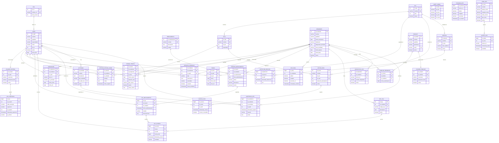

```mermaid
erDiagram

    %% ── MAESTRAS ──────────────────────────────────────────────
    ROL {
        int id_rol PK
        varchar nombre_rol UK
        int nivel_acceso
    }
    ALA {
        int id_ala PK
        varchar nombre UK
        int piso
        boolean activa
    }
    SALA {
        int id_sala PK
        varchar nombre UK
        int id_ala FK
        int capacidad
    }
    LIMITE_JARDIN {
        int id_limite PK
        decimal lat_min
        decimal lat_max
        decimal lon_min
        decimal lon_max
    }
    MEDICAMENTO {
        int id_medicamento PK
        varchar nombre UK
        text descripcion
        varchar unidad
    }

    %% ── PERSONAS ──────────────────────────────────────────────
    STAFF {
        int id_staff PK
        varchar nombre
        varchar apellidos
        varchar especialidad
        varchar email UK
        int id_rol FK
        boolean activo
        date fecha_alta
    }
    USUARIO_SISTEMA {
        int id_usuario PK
        int id_staff FK
        varchar username UK
        varchar password_hash
        boolean activo
    }
    RESIDENTE {
        int id_residente PK
        varchar nombre
        varchar apellidos
        date fecha_nacimiento
        varchar habitacion
        text diagnostico_principal
        varchar nivel_movilidad
        date fecha_ingreso
        date fecha_baja
        boolean activo
    }

    %% ── OPERACIONALES ─────────────────────────────────────────
    ASIGNACION {
        int id_asignacion PK
        int id_residente FK
        int id_staff FK
        varchar tipo_rol
        boolean es_principal
        date fecha_inicio
        date fecha_fin
    }
    TURNO {
        int id_turno PK
        int id_staff FK
        int id_ala FK
        date fecha
        time hora_inicio
        time hora_fin
    }
    SESION_TERAPIA {
        int id_sesion PK
        int id_residente FK
        int id_terapeuta FK
        int id_sala FK
        date fecha_sesion
        int duracion_min
        varchar tipo_sesion
        boolean asistio
        text notas_sesion
    }

    %% ── CLINICO / CUIDADO DIARIO ──────────────────────────────
    CHECKIN_ESTADO_ANIMO {
        int id_checkin PK
        int id_residente FK
        int id_cuidador FK
        int puntaje
        text notas
        timestamp fecha_registro
    }
    REPORTE_INCIDENTE {
        int id_incidente PK
        int id_residente FK
        int id_staff FK
        varchar tipo
        text descripcion
        varchar severidad
        boolean resuelto
        timestamp fecha_incidente
    }
    HORARIO_MEDICAMENTO {
        int id_horario PK
        int id_residente FK
        int id_medicamento FK
        time hora_administracion
        varchar dosis
        varchar frecuencia
        boolean activo
    }
    LOG_MEDICAMENTO {
        bigint id_log PK
        int id_horario FK
        int id_cuidador FK
        timestamp fecha_administracion
        varchar metodo
        text observaciones
    }

    %% ── IoT ───────────────────────────────────────────────────
    GPS_PING {
        bigint id_ping PK
        int id_residente FK
        decimal latitud
        decimal longitud
        decimal precision_m
        timestamp timestamp_servidor
    }
    NFC_TAG {
        int id_tag PK
        int id_residente FK
        varchar codigo_tag UK
        text descripcion
        boolean activo
    }
    NFC_EVENTO {
        bigint id_evento PK
        int id_tag FK
        int id_staff FK
        bigint id_log_med FK
        timestamp timestamp_evento
        varchar resultado
    }
    LECTOR_RFID {
        int id_lector PK
        varchar nombre
        int id_ala FK
        int id_sala FK
        text ubicacion_descripcion
        boolean activo
    }
    ACCESO_RFID {
        bigint id_acceso PK
        int id_lector FK
        int id_staff FK
        timestamp timestamp_acceso
        boolean acceso_concedido
    }
    BEACON {
        int id_beacon PK
        varchar nombre UK
        int id_ala FK
        varchar mac_address
        boolean activo
    }
    DETECCION_BEACON {
        bigint id_deteccion PK
        int id_beacon FK
        int id_staff FK
        timestamp timestamp_deteccion
        int rssi
    }

    %% ── AUDITORIA ─────────────────────────────────────────────
    LOG_AUDITORIA {
        bigint id_log PK
        int id_usuario FK
        varchar tabla_afectada
        varchar operacion
        int id_registro
        timestamp timestamp_operacion
        varchar ip_cliente
    }

    %% ── PORTAL FAMILIAR ───────────────────────────────────────
    FAMILIAR {
        int id_familiar PK
        varchar nombre
        varchar apellidos
        varchar parentesco
        varchar email UK
        boolean activo
    }
    FAMILIAR_RESIDENTE {
        int id_vinculo PK
        int id_familiar FK
        int id_residente FK
        date fecha_autorizacion
    }
    USUARIO_FAMILIAR {
        int id_usuario PK
        int id_familiar FK
        varchar username UK
        varchar password_hash
        boolean activo
    }

    %% ── GPS AVANZADO ──────────────────────────────────────────
    DISPOSITIVO_GPS {
        int id_dispositivo PK
        int id_residente FK
        varchar device_id UK
        varchar nombre_dispositivo
        boolean activo
    }
    POSICION_GPS {
        bigint id_posicion PK
        varchar device_id
        decimal latitud
        decimal longitud
        decimal velocidad
        timestamp ts_servidor
    }
    ZONA_GPS {
        int id_zona PK
        varchar nombre
        decimal latitud_centro
        decimal longitud_centro
        decimal radio_metros
        varchar tipo_zona
        boolean activa
    }
    ALERTA_GPS {
        bigint id_alerta PK
        int id_zona FK
        varchar device_id
        timestamp timestamp_alerta
        boolean atendida
    }

    %% ── ACTIVIDADES NFC ───────────────────────────────────────
    ACTIVIDAD {
        int id_actividad PK
        varchar nombre
        text descripcion
        varchar tipo_actividad
        int id_staff_crea FK
        boolean activa
    }
    ASISTENCIA_NFC {
        bigint id_asistencia PK
        int id_residente FK
        int id_actividad FK
        int id_staff FK
        timestamp timestamp_registro
        varchar metodo
        text notas
    }

    %% ── RELACIONES ────────────────────────────────────────────

    %% Maestras
    ROL            ||--o{ STAFF              : "define rol"
    ALA            ||--o{ SALA              : "contiene"
    ALA            ||--o{ TURNO             : "asignada en"
    ALA            ||--o{ LECTOR_RFID       : "ubicado en"
    ALA            ||--o{ BEACON            : "instalado en"
    SALA           ||--o{ SESION_TERAPIA    : "sede de"
    SALA           ||--o{ LECTOR_RFID       : "dentro de"

    %% Personas
    STAFF          ||--o| USUARIO_SISTEMA   : "tiene cuenta"
    STAFF          ||--o{ ASIGNACION        : "participa"
    STAFF          ||--o{ TURNO             : "trabaja en"
    STAFF          ||--o{ SESION_TERAPIA    : "dirige"
    STAFF          ||--o{ CHECKIN_ESTADO_ANIMO : "registra"
    STAFF          ||--o{ REPORTE_INCIDENTE : "reporta"
    STAFF          ||--o{ LOG_MEDICAMENTO   : "administra"
    STAFF          ||--o{ NFC_EVENTO        : "escanea"
    STAFF          ||--o{ ACCESO_RFID       : "accede con"
    STAFF          ||--o{ DETECCION_BEACON  : "detectado en"
    STAFF          ||--o{ ACTIVIDAD         : "crea"
    STAFF          ||--o{ ASISTENCIA_NFC    : "registra"
    USUARIO_SISTEMA ||--o{ LOG_AUDITORIA    : "genera"
    RESIDENTE      ||--o{ ASIGNACION        : "asignado"
    RESIDENTE      ||--o{ SESION_TERAPIA    : "participa"
    RESIDENTE      ||--o{ CHECKIN_ESTADO_ANIMO : "evaluado"
    RESIDENTE      ||--o{ REPORTE_INCIDENTE : "involucrado"
    RESIDENTE      ||--o{ HORARIO_MEDICAMENTO : "prescrito"
    RESIDENTE      ||--o{ GPS_PING          : "genera"
    RESIDENTE      ||--o{ NFC_TAG           : "tiene"
    RESIDENTE      ||--o{ FAMILIAR_RESIDENTE : "vinculado"
    RESIDENTE      ||--o{ DISPOSITIVO_GPS   : "porta"
    RESIDENTE      ||--o{ ASISTENCIA_NFC    : "participa"

    %% Clinico
    MEDICAMENTO    ||--o{ HORARIO_MEDICAMENTO : "prescrito en"
    HORARIO_MEDICAMENTO ||--o{ LOG_MEDICAMENTO : "registrado"
    LOG_MEDICAMENTO ||--o{ NFC_EVENTO       : "via NFC"
    NFC_TAG        ||--o{ NFC_EVENTO        : "genera"

    %% IoT
    LECTOR_RFID    ||--o{ ACCESO_RFID       : "registra"
    BEACON         ||--o{ DETECCION_BEACON  : "detecta"

    %% Familiar
    FAMILIAR       ||--o{ FAMILIAR_RESIDENTE : "vinculado"
    FAMILIAR       ||--o| USUARIO_FAMILIAR  : "tiene cuenta"

    %% GPS
    ZONA_GPS       ||--o{ ALERTA_GPS        : "genera"

    %% Actividades
    ACTIVIDAD      ||--o{ ASISTENCIA_NFC    : "registrada en"
```
